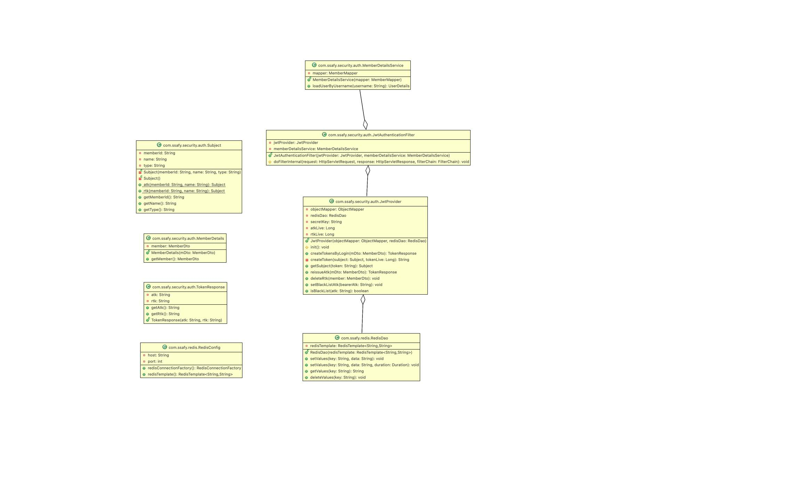

> #### 9기 대전 5반 04조 박영기 홍지민

## 프로젝트명

### MuckKit  - 맛집 여행 플래너 프로젝트

 

## 프로젝트 설명

### 진행 일자

2023.05.25

### 개발 언어/프로그램

Java / STS / Tomcat / MySQL / Redis / VSCode

### 라이브러리/오픈소스

Spring Framework (Spring Boot)

myBatis Framework

Vue.js / JavaScript / Bootstrap-vue

### 사용 데이터

공공데이터 포털 

- 한국관광공사_국문 관광정보 서비스_GW

### 설계
*요구사항*
*요구사항*
*테이블 구조도*
*클래스 다이어그램 DTO*
*클래스 다이어그램 Security, Redis*
*클래스 다이어그램 Controller, Service*

## 주요 기능

### 1) 회원 관리

- 회원 등록, 조회, 수정, 탈퇴

- 이메일 인증을 통한 신뢰성 있는 회원
 
- 마이페이지 내 회원 본인이 작성한 플랜, 후기, 좋아요 리스트 조회

 
  
### 2) 플랜 공유 게시판

- 여러 유저의 계획을 커스텀하여 보다 쉽게 나만의 여행 계획 세우기 

- 실시간으로 정렬되는 해시태그 필터 기능으로 원하는 정보 찾기

- 좋아요 기능을 통해 마음에 드는 플랜 저장

 

### 3) 여행 후기 게시판

- 유저들의 후기를 통해 여행지에 대한 정보 공유

- 생생한 여행 리뷰를 통해 다양한 여행지 정보 공유

- 다른 유저의 여행지 리스트에서 원하는 여행지를    선택하여 나의 플랜으로 추가 가능

- 댓글 기능을 통해 유저 간 소통 활성화

 

